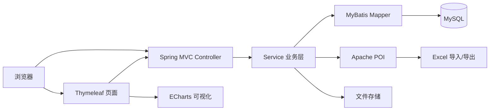
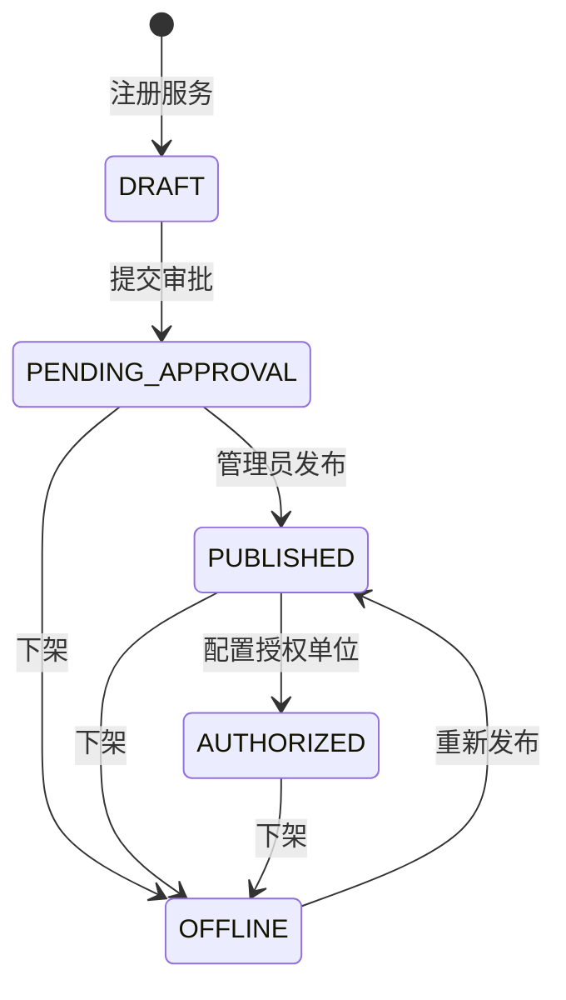

# Urban Archive Data Sharing Platform

> 数据要素 × 房屋建筑城建档案协同共享服务平台


一个面向城建档案管理部门与外部协同单位的数据共享平台。系统围绕城建档案数据要素，提供 Excel 数据治理、服务组件全生命周期管理、内部审批、角色权限隔离、运行监控和安全事件展示等能力。

项目采用经典 Java Web 分层架构，完整覆盖数据建模、批量导入、文件管理、权限控制、状态流转、分页检索、可视化展示和工程化配置，适合作为 Spring Boot 企业应用开发实践项目。

## 核心功能

| 模块 | 功能 |
| --- | --- |
| 数据要素管理 | 管理业务数据、业务元数据、服务实例数据和日志数据四类资源 |
| Excel 数据治理 | 动态识别中英文字段、按数据子类拆分记录、保留扩展字段、检测重复文件 |
| 数据合规检查 | 支持合规自检和数安港检查，数据变更后自动重置检查状态 |
| 服务组件管理 | 服务注册、编辑、提交审批、发布、授权、技术配置和下架 |
| 内部审批 | 审批申请、附件上传、条件检索、分页、通过与拒绝 |
| 权限隔离 | 区分档案管理员与外部部门，按部门归属、发布状态和授权范围控制访问 |
| 监控与安全 | 展示服务健康度、调用趋势、运行事件和安全事件 |
| 系统设置 | 修改密码、配置登录背景、管理用户会话 |

## 技术栈

### 后端

| 技术 | 版本/用途 |
| --- | --- |
| Java | 8，主要开发语言 |
| Spring Boot | 2.7.18，应用容器与自动配置 |
| Spring MVC | Web 路由、参数绑定、文件上传和 JSON 接口 |
| MyBatis | 2.2.2，数据持久层与 XML 动态 SQL |
| MySQL Connector/J | 8.0.33，数据库连接驱动 |
| PageHelper | 1.4.3，服务端分页查询 |
| Apache POI | 5.2.3，Excel 导入、解析和导出 |
| Bean Validation | 表单与接口参数校验基础设施 |
| Maven | 依赖管理、编译、测试与打包 |

### 前端

| 技术 | 用途 |
| --- | --- |
| Thymeleaf | 服务端页面渲染和权限条件展示 |
| HTML5 / CSS3 | 响应式后台管理界面 |
| JavaScript / Fetch API | 异步 CRUD、弹窗和状态交互 |
| ECharts 5.4.3 | 监控指标与安全趋势可视化 |

### 数据与工程化

| 技术点 | 实现方式 |
| --- | --- |
| 关系型建模 | 用户、审批、服务组件、上传批次、业务记录、子类配置等实体表 |
| 配置安全 | 数据库地址、用户名和密码支持环境变量注入 |
| 文件存储 | UUID 文件名、日期目录分区、静态资源映射 |
| 重复检测 | 对文件内容计算 SHA-256，按数据类型识别重复批次 |
| 事务处理 | 导入、批次删除和合规状态更新使用事务保证一致性 |
| 数据兼容 | 启动时检查并补充表结构，兼容已有数据库 |

## 系统架构



代码按职责划分为 Controller、Service、Mapper、Entity、Config 和 Util，各层边界清晰：

- Controller 负责登录校验、权限入口、请求参数和响应结果；
- Service 封装审批、服务状态流转、数据导入和合规检查等业务规则；
- Mapper 与 XML 负责数据库访问、动态筛选、统计和批量写入；
- Entity 对应核心业务模型；
- Config 负责 MyBatis、静态资源映射和数据库初始化；
- Util 提供权限判断、字段字典和文件存储能力。

## 关键实现亮点

### 1. 可扩展的 Excel 数据导入管道

系统不是将 Excel 整行简单保存，而是执行一套完整的数据治理流程：

```text
读取首个工作表
  → 标准化表头
  → 匹配中文名、英文名和历史别名
  → 按数据子类聚合字段
  → 一行拆分为多条领域记录
  → 未识别字段写入 extra_json
  → 分批写入数据库
  → 重置相关子类合规状态
```

- 使用字段字典统一管理四类一级数据及其子类；
- 支持中英文表头和历史字段别名匹配；
- 未识别列连同样例值保存在扩展字段中，避免数据丢失；
- 单次按 200 条分批写入，兼顾内存占用与数据库写入效率；
- 使用 SHA-256 识别内容相同的文件，降低重复数据风险。

### 2. 服务组件状态机

服务组件通过明确的状态驱动页面操作与权限判断：



外部部门只能维护本部门的服务申请；管理员负责发布、授权、技术配置和下架，形成完整的服务治理闭环。

### 3. 数据与文件一致性管理

- 每次上传建立独立批次，并记录文件哈希、大小、上传人、识别列和涉及子类；
- 业务记录通过 `batch_id` 关联原始批次，支持批次级追溯和删除；
- 审批附件与上传文件使用 UUID 重命名，按日期分目录存储；
- 删除审批记录时同步清理附件；删除数据批次时在事务中清理关联业务记录。

### 4. 基于角色和部门的数据权限

系统使用 Session 保存用户、角色和部门信息，并在 Controller 和页面模板中进行双重约束：

- 档案管理员拥有数据治理、审批、监控和服务治理权限；
- 外部部门只能访问服务组件与个人设置；
- 外部部门仅能看到本部门创建、公开发布或明确授权给本部门的服务；
- 编辑、删除、发布、授权和配置分别执行服务端权限检查。

### 5. 数据库演进与初始化

应用启动时通过 `DataInitializer` 检查核心表和字段，补充历史数据库缺失结构，并为四类数据初始化默认子类配置。初始化 SQL 同时提供完整建库能力，便于新环境快速部署。

## 项目结构

```text
.
├── src/main/java/com/collaborative/sharing
│   ├── config/       # MyBatis、静态资源与数据初始化
│   ├── controller/   # 页面路由和接口层
│   ├── entity/       # 领域实体
│   ├── mapper/       # MyBatis Mapper 接口
│   ├── service/      # 核心业务逻辑
│   └── util/         # 权限、字段字典和文件工具
├── src/main/resources
│   ├── mapper/       # MyBatis XML 映射
│   ├── static/       # 静态样式
│   ├── templates/    # Thymeleaf 页面
│   └── application.yml
├── database-init.sql # 数据库与基础数据初始化
├── init-new-tables.sql
├── start.sh          # 环境检查、建库、编译和启动
└── 系统操作手册.md
```

## 快速启动

### 环境要求

- JDK 8+
- Maven 3.6+
- MySQL 8.0

### 一键启动

```bash
git clone https://github.com/MickeyRay0624/urban-archive-data-sharing-platform.git
cd urban-archive-data-sharing-platform

export DB_PASSWORD='你的MySQL密码'
chmod +x start.sh
./start.sh
```

启动后访问：<http://localhost:8080>

可选环境变量：

```bash
export DB_URL='jdbc:mysql://localhost:3306/collaborative_sharing?useUnicode=true&characterEncoding=utf8&useSSL=false&serverTimezone=Asia/Shanghai'
export DB_USERNAME='root'
export DB_PASSWORD='你的MySQL密码'
```

### 手动启动

```bash
mysql -u root -p < database-init.sql
export DB_PASSWORD='你的MySQL密码'
mvn spring-boot:run
```

### 构建可执行包

```bash
mvn clean package
java -jar target/sharing-system-1.0.0.jar
```

## 数据模型

| 表 | 说明 |
| --- | --- |
| `users` | 用户、角色与所属部门 |
| `todo_items` | 内部审批及附件信息 |
| `service_components` | 服务注册、授权、配置和状态 |
| `data_element_subtype_config` | 数据类型、子类与合规状态 |
| `data_element_upload_batch` | Excel 上传批次与识别结果 |
| `data_element_business_record` | 拆分后的领域记录及扩展字段 |
| `system_settings` | 登录背景等系统配置 |

## 文档

详细的账号权限、数据导入、服务管理和日常运维步骤请查看：[系统操作手册](./系统操作手册.md)。

## 后续演进方向

- 引入 Spring Security 与 BCrypt，完善认证和细粒度授权；
- 使用 Redis 管理 Session、热点数据和分布式锁；
- 将上传文件迁移至 MinIO 或对象存储；
- 引入 Flyway 管理数据库版本；
- 增加 OpenAPI 接口文档和自动化测试覆盖；
- 接入真实监控指标、审计日志与告警平台；
- 使用 Docker Compose 统一应用与数据库部署环境。

